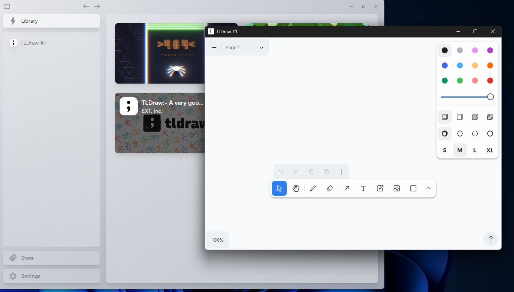
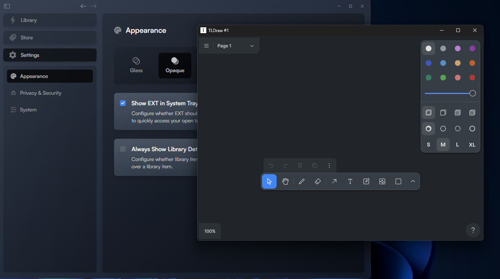

# TlDraw EXT extension build

This project contains TLDraw widget built for the EXT extension store. TLDraw is an opensource whiteboard that has many wonderful features. The aim of this project is to build TLDraw and port it over to EXT platform.


## Run Locally

Clone the project

```bash
  git clone https://github.com/JoelMekonnen/TLDraw-EXT.git
```

Go to the project directory

```bash
  cd TLDraw-EXT
```

Install dependencies

```bash
  npm install
```

Generate the build

```bash
  npm run build
```

After the above command there should be a folder called dist. Install the dist folder into the EXT platform.

## Screenshots
light mode


dark mode


